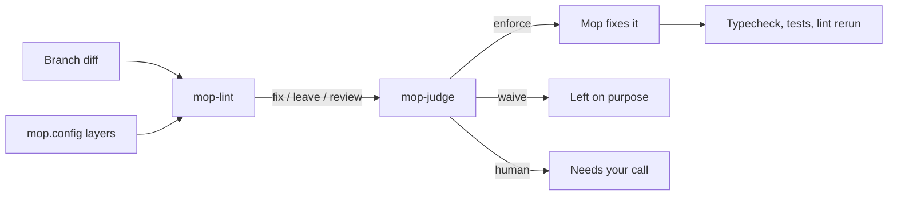

mop cleans the slop a branch added, and the harness decides what counts as slop.

This repo ships two things that release together under one version:

| Part | What it is | Where |
| --- | --- | --- |
| mop plugin | Claude Code skills: `/mop`, `/mop:tests`, `/mop:code`, `/mop:docs`, `/mop:ui`, `/mop:break` | `plugins/mop/` |
| `mop-harness` | npm package: the ESLint harness, the `mop-lint` and `mop-judge` CLIs | `src/`, `bin/` |

## Why it exists

AI-written branches add the same slop again and again: comments that narrate the code, nested ternaries, non-null assertions, mocked services, prose full of em dashes. A plain linter flags the whole file, so you fix code the branch never touched and churn the diff. mop limits every check to the lines the branch added, fixes what it can prove safe, and asks you about the rest.

## How it works

### The mops

Each mop runs one loop on one kind of file: detect, judge, fix, verify, report. `/mop` sorts the changed files by type and runs `code`, `ui`, `tests`, `docs`, then `break`, one at a time, each in its own commit. Every mop takes `[BASE_REF|path] [--no-commit]` and never pushes unless you ask.

| Mop | Detector | Proof that nothing broke |
| --- | --- | --- |
| `code` | `mop-lint` | Typecheck, tests, lint rerun |
| `tests` | Test audit rules | Breaks the source and watches a remaining test fail |
| `docs` | The repo's doc linter, AI prose tells | Doc linter at zero warnings |
| `ui` | Impeccable detector | Detector rerun and a rendered check |
| `break` | Adversarial attacks | A reproduction and a failing regression test per hole |

### The harness

`harness(config)` in `src/harness.ts` returns a flat ESLint config. It stacks the sonarjs, unicorn, security and React recommended rules. Then it adds the mop rules: no comments, size limits and a `process.env` ban. Test files also get mock budgets, a ban on mocking the subject under test, and deterministic fixtures. Tailwind and Playwright rules are opt-in.

`mop-lint` runs that config. It finds the merge base with the base ref, keeps findings on added lines only, and counts untracked files as fully added. Each finding gets an action from `mop.fix` and `mop.leave`:

| Action | Meaning |
| --- | --- |
| `fix` | The rule matches `mop.fix`. `--fix` autofixes it on added lines. |
| `leave` | The rule matches `mop.leave`. The value is the reason, and it is final. |
| `review` | Neither list matches. Jev or you decide. |

### The config layers

`loadConfig()` merges four layers. The last one wins. Objects merge key by key, and arrays replace whole.

| Layer | Source |
| --- | --- |
| Preset | `strict`, always the base (`src/presets/strict.ts`) |
| Taste | `mop.config.{mjs,js,json}` in `$XDG_CONFIG_HOME/mop`, else `~/.config/mop` |
| Org | Whatever the repo or taste file names in `extends`: a path, a package, or `"strict"` |
| Repo | `mop.config.{mjs,js,json}` at the git root |

Run `mop-lint --print-config` to see the merged result and its `sources`.

### The judge

`mop-judge` sends every finding to Jev in one `jev batch` call. Jev answers three questions: is it real slop, does the code around it follow the pattern on purpose, and could the fix change behavior. The verdict is `enforce` only when Jev is at least 90% sure of each answer and all three point to a safe fix. Any doubt becomes `human`. See [JUDGE.md](../plugins/mop/JUDGE.md).

## Guarantees

- **Branch lines only.** With `--base`, `mop-lint` reports and autofixes lines the branch added since the merge base. Commits that land on the base later never count.
- **`leave` is final.** No Jev verdict and no mop overrides a config `leave`.
- **No guessing on doubt.** A finding Jev is unsure about, or whose fix could change behavior, goes to **Needs your call** untouched.
- **Jev is optional.** Without `jev`, or with `JEV_ENABLED=0`, every verdict is `unjudged` and the mops fall back to the config sort.

Not guaranteed: lint autofixes can rewrite more of a file than the finding. Each mop keeps its edits to lines the branch owns or reports the churn.

## Tradeoffs and limits

| Item | Value |
| --- | --- |
| Node | 22 or later |
| Files `mop-lint` checks | `.js`, `.jsx`, `.ts`, `.tsx` and their `c`/`m` variants |
| Jev auto threshold | 0.9 certainty per question |
| Strict size limits | 2 params, 50 lines per function, 250 per file, 600 per `.tsx` file |
| `eslint-disable` comments | Ignored under `strict` (`inlineConfig: false`) |
| Repo `eslint.config.mjs` | Ignored by `mop-lint`; put repo taste in `mop.config.mjs` |

Function length, file length, complexity and statement count are `leave` under `strict`. A mop reports them but does not split your functions, because a size limit is a design conversation.

## When not to use it

Do not use mop to find bugs or add coverage; use a code review instead. Do not use it for a redesign or for over-engineering review. Do not run two mops on the same files at once, because they overwrite each other's edits.

## Explore mop

- **Plugin skills**: what each mop does, step by step. [Learn more](../plugins/mop/README.md)
- **Config keys**: every `mop.config` key and the CLI flags. [Learn more](../README.md#config)
- **Judging**: verdicts and the **Needs your call** table. [Learn more](../plugins/mop/JUDGE.md)
- **Contributing**: change the harness, a rule, or a mop. [Learn more](contributing.md)
- **Strict preset**: the default limits and sort lists. [Learn more](../src/presets/strict.ts)
